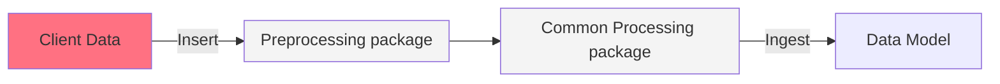
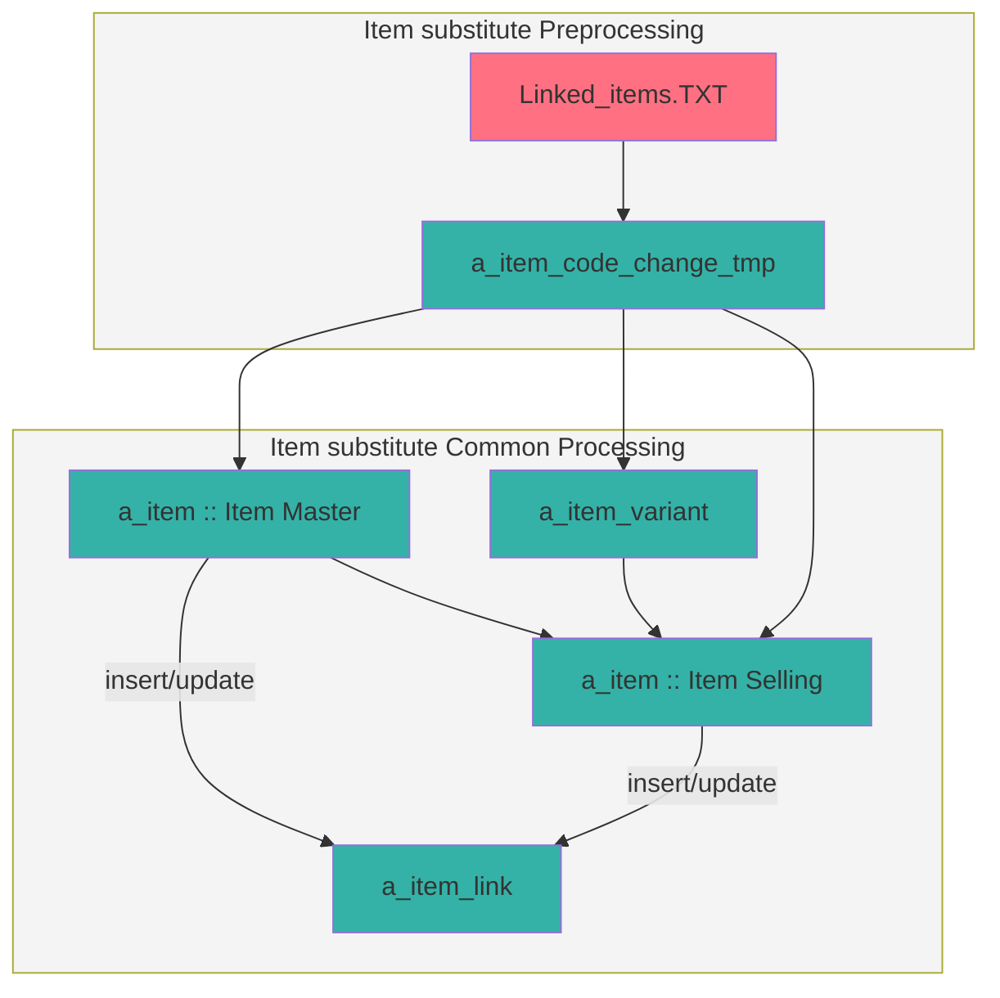

## Introduction

In this article, you can find a set of *SSIS packages* documentation writing guidelines.  

## Drawing overview for the SSIS packages
The purpose of this overview is to have a better understanding of the behavior of the packages.
In most cases, the EVO ETL packages are made of two steps, **pre-processing** and **common**. Each one has different effects on the data model and its tables.

For example, in pre-processing packages, we insert client data into some temporary tables, and then by SSIS common package, we ingest the data from those temporary tables into data model dimensions tables. Thus, a graph can easily show the relationship between these tables and the packages.

A simple example of this overview can be:

Now we can explain the graph above in more detail. As you can see, a temp table, `a_item_code_change_tmp`, is involved in the pre-processing package and this table will distribute the data to the destination tables by the SSIS common package.




In the next section, you can find more information about a tool to implement these graphs easily.


## Mermaid

It is suggested to use `Mermaid` for showing charts and graphs in any document which explains complex logic (such as the flow of an ETL package).  

GitLab Flavored Markdown (GLFM) allows Mermaid embedding, so you create diagrams using just *plain text* inside a markdown file.  

- **Mermaid documentation**: https://mermaid-js.github.io/mermaid/
- **Local editor**: You can add an extension like `Markdown Preview Mermaid` to your VS Code to render the mermaid code. https://marketplace.visualstudio.com/items?itemName=bierner.markdown-mermaid

## Rules

In the table below you can find the information about the rules that we need to follow for drawing **SSIS overview** graphs.


|Overview objects     |Mermaid syntax	|Evo Colors |
|---	    |---	                    |---	    |
|Packages   |`subgraph`                 |`#F4F4F4`  |
|Files 	    |File's name   	            |`#FF7182`  |
|Tables	    |Table's name   	        |`#34B2A7`  |
|Externals  |External resource's name   |`#FF7182`  |
|Database   |External resource's name   |`#FF7182`  |
|Notes      |note1`>`your text`]`       |`#FFF2CC`  |
|Links      |`-->`                      |Insert: `#FF7182` <br> Update:`#34B2A7` <br> Other cases: `#000000`|
|Connections|`---`                      |Insert: `#FF7182` <br> Update:`#34B2A7` <br> Other cases: `#000000`|
 
### Usage example:
In order to show a **package** you can use a `subgraph` annotation inside a `flowchart` diagram.
```
flowchart TB
    subgraph pre [Ecomm Transaction Preprocessing]
    end
```
In order to show objects like **files** and **tables** we can use a simple rectangle. You simply can write the object's name to create a simple rectangle.
```
flowchart LR
    file1
    table1
```
If the name of the object has a space inside, you can write down the name inside a pair of brackets.
```
flowchart LR
    file1[file number one]
    table1
```
For the links and connections, you can use `-->` and `---`. If you need a longer connection you can add `-` more to the links.
```
flowchart LR
    file1[file number one]
    table1
    
    file1 ------> table1
``` 

> **Note:**  
> In order to use the standard colors you can add this snippet at the end of the flowchart, you only need to replace your object's name in the sections below.  
For example, if your file's name is `item.csv`, you can replace it with `file1`.

```text
%% Class Definitions
%% =================Files===========================
class file1 cssClass1;
classDef cssClass1 fill:#FF7182 
%% =================Tables==========================
class obj1, obj2 ssClass2;
classDef cssClass2 fill:#34B2A7   
%% =================Package=========================
class pre,common cssClass3;
classDef cssClass3 fill:#F4F4F4   
```
